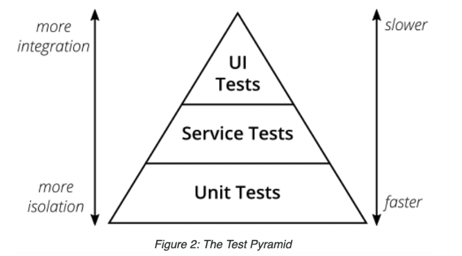

# Test의 종류

## 연동의 범위에 따른

- [The Test Pyramid](https://bit.ly/2YMpC8K)

    

from Succeeding with Agile, Mike Cohn

현재 적용하기에는 다소 모호할 정도 추상적임

## Clean Code Talks - Unit Testing

[Unit Testing](Unit_Testing.md)

## Unit Test의 종류 (from ‘Working Effectively with Unit Tests', Jay Fields)

- Solitary Unit Test
    - constraints
        - 절대 테스트하고 있는 클래스 외에 다른 객체는 테스트에 포함되지 않음
        - Class Under Test가 테스트에서 발견되는 유일한 구현 클래스(concrete class)여야 함
- Sociable Unit test
    - Solitary Unit Test로 분류될 수 없는 모든 Unit Test는 Sociable Unit Test
- 이러한 정의에 따라 이 책에서는 Solitary Unit Test가 하나도 없음
- Solitary와 Sociable Unit Test의 적절한 혼합이 최적의 해결책이라고 생각함